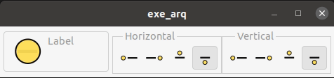

# cap3_button_icon_image-gtkmm 3

## OBS : Este é um "caderno", as informações contidas neste arquivo são anotações pessoais e podem apresentar informações incorretas.

## Perguntas respondidas:

* Como posicionar icone em um botão?
* Como esconder a borda de um botão?
* Como um modelo de Gtk::RadioButton utilizando Gtk::Button?
* Como adicionar flags aos botões?
* Como criar sinais, ligar um sinal e um botão e realizar alterações de propriedades de widgets?

## APP

* Este exemplo mostra os tipos de posicionamentos de imagens em um botão.

    * Para inserir as imagens foi utilizado os seguintes procedimentos;

        ~~~c
        this->ref1= Gdk::Pixbuf::create_from_file("img/d.svg",24,24,false);
        this->img1.set(this->ref1);
        this->m_btn1.set_image(this->img1);
        ~~~

    * Para posicionamento das imagens foi utilizado os seguintes procedimentos.

        ~~~c
        set_image_position(Gtk::POS_LEFT);

        set_image_position(Gtk::POS_RIGHT);
        
        set_image_position(Gtk::POS_TOP);

        set_image_position(Gtk::POS_BOTTON);
        ~~~

    * Outro método utilizado foi o `void Gtk::Button::set_relief(Gtk::ReliefStyle relief)`, este método retira a borda do botão de forma parcial ou completamente.

        ~~~c
        Gtk::RELIEF_NORMAL
        Gtk::RELIEF_HALF
        Gtk::RELIEF_NONE
        ~~~

    * Para manter os botoes pressionados foi utilizado o método `void Gtk::Widget::set_state_flags(Gtk::StateFlags flags, bool clear = true)`.

        ~~~c
        Gtk::STATE_FLAG_NORMAL
        Gtk::STATE_FLAG_CHECKED
        ~~~

        O primeiro volta ao estado normal, o segundo mantém o botão pressionado.

* Os métodos para controle marca o botão com a flag Checked e desmarcam o restante. Observe o exemplo.

    * Para o botão que move o icone para o lado esquerdo.

    ~~~c
    void Botoes::on_btn2_action(){
        if(this->m_btn2.get_state_flags() == 163){
            this->m_btn1.set_state_flags(Gtk::STATE_FLAG_NORMAL,true);
            this->m_btn2.set_state_flags(Gtk::STATE_FLAG_CHECKED,true);
            this->m_btn3.set_state_flags(Gtk::STATE_FLAG_NORMAL,true);
            this->m_btn4.set_state_flags(Gtk::STATE_FLAG_NORMAL,true);

            this->m_btn_img.set_image_position(Gtk::POS_RIGHT);  //Seta a posição o icone.
        }
    }
    ~~~

    * _Observe que utilizei no if o método `this->m_btn2.get_state_flags() == 163`. Utilizei o valo 163, pois, o método get_state_flags não retorna o `Gtk::STATE_FLAG_CHECKED` que corresponde ao 2048. Ao imprimir o valor de retorno, temos o valor 163. Não sei dizer, até o momento se este retorno está correto ou ou não._ 